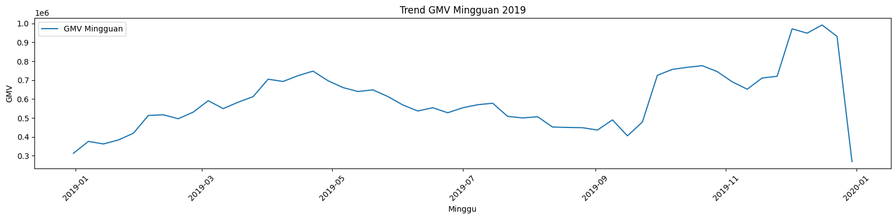

# 📈 Time Series Forecasting

## 🎯 Objective
Proyek ini bertujuan untuk membangun model time series forecasting yang mampu memprediksi tren penjualan/pendapatan di masa depan. Dengan memanfaatkan metode statistik (ARIMA & ETS), analisis ini diharapkan dapat membantu perusahaan dalam mengoptimalkan manajemen persediaan, merencanakan strategi promosi, serta mendukung pengambilan keputusan bisnis berbasis data.

## 🗃️ Dataset
- Sumber: e-commerce sales data
- Periode: Satu tahun Jan-Dec 2019
- Target: Total Revenue

## 🧩 Metodologi
- EDA Time Series: cek missing/duplikat/outlier, dekomposisi trend–seasonality–residual.
- Stationarity: Uji ADF
- Modeling:
  - ARIMA vs ETS (Exponential Smoothing)
  - Evaluation: Train/validation split; metrik MAPE, MAE, RMSE.
  - Forecast: horizon (30 hari) + plot actual vs forecast.
 

## 📈 Hasil (dari notebook)

- Perbandingan model (validasi umum)
  - MAPE ARIMA: 67.66%
  - MAPE ETS: 67.41% → ETS sedikit lebih baik
- Evaluasi horizon khusus (30 langkah ke depan)
  - MAPE: 28.01%
  - MAE: 38,775.81
  - RMSE: 39,623.95
- Model terbaik (berdasarkan MAPE): ETS (Exponential Smoothing)
- Catatan pola: prediksi penjualan harian berada di kisaran ±15–16 unit/hari (bisa dipakai acuan alokasi stok harian).

## 💡Insight
- Total Revenue Forecast (Januari 2020):
  - Rata-rata pendapatan harian diprediksi stabil sekitar 97,000–98,000+.
  - Tim keuangan dapat menyiapkan alokasi cash flow atau target bulanan berdasarkan prediksi ini.
  - Variasi cukup kecil → cocok untuk perencanaan jangka pendek.

- Produk Macbook Pro Laptop:
  - Prediksi penjualan harian berada di kisaran 15–16 unit per hari.
  - Ini dapat dijadikan dasar alokasi stok harian dan strategi promosi.
  - Bila ingin meningkatkan penjualan, perlu mendorong di segmen high-end seperti Macbook melalui kampanye khusus.

- Model Evaluasi:
  - ETS memiliki akurasi sedikit lebih baik dibanding ARIMA untuk data ini (MAPE lebih kecil).
  - Disarankan menggunakan ETS untuk prediksi lanjutan, namun validasi berkala tetap penting (misal rolling forecast).
 

## 📊 Visual

